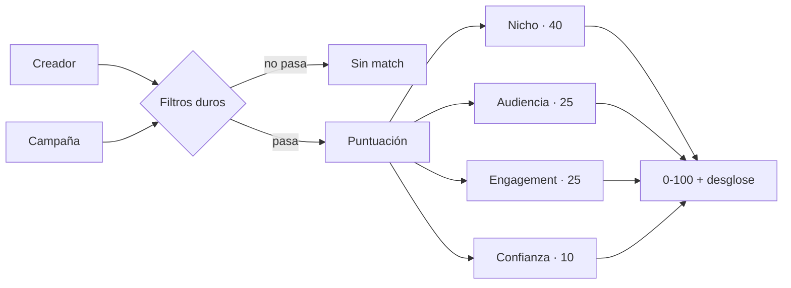

<div align="center">

# BrandFluence AI

**La plataforma que conecta creadores con marcas.**
Matching con IA para campañas UGC.

[](https://nextjs.org)
[](https://www.typescriptlang.org)
[](https://supabase.com)
[](#tests)
[](#estado-del-proyecto)

</div>

---

## El problema

El 95% de los creadores de contenido nunca encuentra marcas con las que colaborar. No porque no tengan audiencia, sino porque **no existe un sitio donde una marca busque "creadora de fitness con más de 20.000 seguidores y buen engagement" y obtenga una lista ordenada**.

Las marcas, por su lado, pagan agencias caras o van a ciegas por DM.

BrandFluence AI puntúa cada pareja creador–campaña del 0 al 100 y explica por qué.

---

## Estado del proyecto

> **MVP en desarrollo activo. Todavía no está desplegado ni tiene usuarios reales.**

Lo que ya funciona, verificado de extremo a extremo contra una base de datos real:

| | |
|---|---|
| ✅ | Registro, login y cierre de sesión (email + Google) |
| ✅ | Perfiles de creador y de marca, editables |
| ✅ | Publicación de campañas |
| ✅ | **Algoritmo de matching** con puntuación explicada |
| ✅ | Aplicar y descartar candidaturas |
| ✅ | Panel diferenciado para creador y para marca |
| ✅ | **Aceptar candidato → crear colaboración** |
| 🚧 | Ciclo de vida de la colaboración (entregables, cerrar) |
| 🚧 | Subida de imágenes y vídeo |
| 📋 | Pagos con Stripe, notificaciones por email |
| 📋 | Apps nativas iOS y Android (Expo) |

---

## Cómo funciona el matching

El corazón del producto. Una función **pura** —sin base de datos, sin efectos— que recibe un perfil y una campaña y devuelve una puntuación con su desglose.



### Filtros duros

No son penalizaciones: si no se cumplen, **el match no llega a existir**.

- El nicho del creador no es igual ni afín al de la campaña
- Su audiencia no llega al mínimo exigido
- Está marcado por sospecha de fraude

### Los cuatro componentes

| Componente | Puntos | Criterio |
|---|--:|---|
| **Nicho** | 40 | Coincidencia exacta 40 · nicho afín 24 |
| **Audiencia** | 25 | Cuánto supera el mínimo, con rendimientos decrecientes |
| **Engagement** | 25 | Puntuación completa a partir del 6% |
| **Confianza** | 10 | Verificado +5 · bio completa +3 · sin señales de fraude +2 |

### Tres decisiones que lo diferencian

**La audiencia satura a 10× el mínimo.** Pasar de 10× a 100× no convierte a nadie en un candidato diez veces mejor, y los micro-influencers suelen convertir mejor que los macro. Sin este tope, el algoritmo solo recomendaría cuentas enormes.

**Existen los nichos afines.** Una creadora de fitness ve campañas de salud puntuadas a 24 sobre 40, en lugar de no verlas nunca. El mapa de afinidades se declara en un sentido y se simetriza solo, así que no puede quedar desparejado.

**"Sin datos de engagement" no es "engagement 0".** Quien todavía no ha rellenado el campo recibe una puntuación baja pero no nula. Quien tiene un 0% real recibe cero. Confundirlos castigaría a los usuarios nuevos.

### Un ejemplo real

Lucía: nicho fitness, 48.200 seguidores, 5,4% de engagement, con bio, sin verificar.

| Campaña | Nicho | Audiencia | Engag. | Conf. | **Total** |
|---|--:|--:|--:|--:|--:|
| Lanzamiento proteína vegana *(fitness, mín. 10k)* | 40 | 21,83 | 22,5 | 5 | **89,33** |
| Reto 30 días en casa *(fitness, mín. 20k)* | 40 | 18,82 | 22,5 | 5 | **86,32** |
| Suplementos bienestar *(salud, mín. 5k)* | 24 | 24,84 | 22,5 | 5 | **76,34** |
| Colección ropa técnica *(moda, mín. 50k)* | — | — | — | — | **sin match** |

### Cuándo se recalcula

Al **publicar una campaña** y al **actualizar el perfil de un creador**.

Hay un invariante que el código protege en SQL, no con un `if`: recalcular **nunca** pisa un match que el creador ya aplicó o descartó.

```sql
ON CONFLICT (creator_id, campaign_id) DO UPDATE
   SET match_score = EXCLUDED.match_score
 WHERE matches.status = 'suggested'
```

---

## Del match a la colaboración

Un match recorre cuatro estados, y cada transición la provoca una persona distinta:

```
sugerido ──creador aplica──> interesado ──marca acepta──> aceptado
    │                                                        │
    └──creador descarta──> descartado                        └──> colaboración
```

Aceptar hace dos cosas —mover el match a `accepted` y crear la colaboración— y **las dos ocurren en una sola sentencia SQL**. Si fueran dos, un fallo entre medias dejaría un match aceptado sin colaboración, y el `UNIQUE (match_id)` impediría repararlo reintentando. Una CTE que modifica datos lo resuelve sin reservar un cliente del pool ni escribir `BEGIN`/`COMMIT` a mano, algo que además el pooler de Supabase en modo *transaction* desaconseja:

```sql
WITH accepted AS (
  UPDATE matches m SET status = 'accepted'
    FROM campaigns c JOIN brands b ON b.id = c.brand_id
   WHERE m.id = $2 AND c.id = m.campaign_id
     AND b.user_id = $1              -- la autorización, dentro del WHERE
     AND m.status IN ('interested', 'accepted')
  RETURNING m.id AS match_id, c.budget
)
INSERT INTO collaborations (match_id, agreed_amount)
SELECT match_id, budget FROM accepted
ON CONFLICT (match_id) DO UPDATE SET updated_at = now()
```

Tres detalles que no son accidentales:

**El importe acordado sale del presupuesto de la campaña.** La marca ya lo publicó al crearla; volver a pedirlo al aceptar sería preguntar dos veces lo mismo. Negociarlo será una iteración posterior.

**Aceptar dos veces no falla.** Se admite `accepted` como estado de entrada y el `ON CONFLICT` devuelve la colaboración que ya existía. Un doble clic no se convierte en un 404 confuso.

**No se puede aceptar a quien no ha aplicado.** Un match en `suggested` no entra en el `IN (...)`: la marca no puede empujar a un creador a una colaboración que él no ha pedido.

---

## Stack

| Capa | Elección | Por qué |
|---|---|---|
| Framework | Next.js 16 (App Router) + React 19 | Un solo despliegue para front y back |
| Lenguaje | TypeScript | Los tipos se comparten con la futura app móvil |
| Estilos | Tailwind CSS v4 | Configuración en CSS, sin `tailwind.config.js` |
| Base de datos | PostgreSQL en Supabase | Postgres + Storage + SDKs nativos en un solo sitio |
| Autenticación | NextAuth v5 (Auth.js) | Estrategia JWT, pensando en las apps nativas |
| Validación | Zod | Mismos esquemas en API y formularios |
| Tests | Runner nativo de Node | Cero dependencias añadidas |

---

## Puesta en marcha

**Requisitos:** Node 22+ y una cuenta gratuita de [Supabase](https://supabase.com).

```bash
git clone https://github.com/dgh09/BrandFluence-AI.git
cd BrandFluence-AI
npm install
cp .env.example .env.local
```

**1. Crea el proyecto en Supabase** y copia la cadena de conexión del *Transaction pooler* (puerto **6543**, no el 5432 — en serverless el pooler es obligatorio) a `DATABASE_URL`.

**2. Carga el esquema.** En el SQL Editor de Supabase, pega entero `database/schema.sql` y ejecútalo. Crea 11 tablas.

> Si lo ejecutas dos veces verás `ERROR 42P07: relation already exists`. No es un fallo: significa que ya está aplicado. Para empezar de cero, ejecuta antes `database/reset.sql`.

**3. Genera el secreto de sesión:**

```bash
npx auth secret
```

**4. Arranca:**

```bash
npm run dev
```

Comprueba que la base de datos responde en `http://localhost:3000/api/health`.

### Datos de prueba

```bash
node scripts/seed-demo.mjs          # crea una creadora, una marca y 3 campañas
node scripts/seed-demo.mjs --clean  # los borra
```

El script imprime las credenciales de acceso al terminar.

---

## Scripts

| Comando | Qué hace |
|---|---|
| `npm run dev` | Servidor de desarrollo |
| `npm run build` | Compilación de producción |
| `npm test` | Auditoría de SQL + tests del algoritmo |
| `node scripts/db-inspect.mjs` | Qué tablas, triggers y datos hay ahora mismo |
| `node scripts/seed-demo.mjs` | Datos de demostración |
| `node scripts/check-sql-params.mjs` | Verifica los parámetros de cada consulta |

### Tests

```
✓ 35 consultas revisadas, todas cuadran
# tests 19
# pass 19
# fail 0
```

`check-sql-params.mjs` existe por un motivo concreto: escribir `$2` en una consulta pasando un solo parámetro es un error que **TypeScript no detecta** —no mira dentro de la cadena SQL— y que Postgres solo revela en tiempo de ejecución con un `42P18`. Se coló dos veces antes de automatizar la comprobación.

---

## Estructura

```
src/
├─ app/
│  ├─ (auth)/          login · signup
│  ├─ (dashboard)/     panel · matches · campañas · candidatos · perfil
│  ├─ api/             toda la lógica de negocio
│  └─ onboarding/      elección de tipo de cuenta tras entrar con Google
├─ components/         ui/ · dashboard/ · profile/ · campaigns/ · shared/
└─ lib/
   ├─ matching.ts      ← el algoritmo (función pura)
   ├─ matching.test.ts ← sus 19 tests
   ├─ queries/         acceso a datos por dominio
   ├─ taxonomy.ts      nichos y sectores
   ├─ design-tokens.ts tokens compartidos con la futura app móvil
   └─ auth.ts          configuración de NextAuth
database/
   schema.sql · reset.sql
```

**Toda la lógica de negocio vive en `/api/*`, nunca en Server Components.** No es casualidad: cuando lleguen las apps de iOS y Android consumirán exactamente los mismos endpoints, sin reescribir nada.

---

## Notas de seguridad

- **Los endpoints de "lo mío" no llevan id en la URL.** Es `/api/profile`, no `/api/creators/[id]`. La identidad sale de la sesión, así que no existe la posibilidad de editar el perfil de otra persona cambiando un identificador.
- **La autorización vive dentro del SQL.** Las acciones sobre un match filtran por `user_id` en el propio `WHERE`: un match ajeno afecta a cero filas. No hay una comprobación previa que se pueda olvidar.
- **La unicidad se resuelve capturando la violación de constraint**, no con un `SELECT` previo, que dejaría una ventana de carrera entre la lectura y la escritura.
- Las contraseñas se guardan con bcrypt (coste 12). Los logins fallidos comparan contra un hash señuelo para que el tiempo de respuesta no revele si el email existe.

---

## Diseño

Interfaz *dark* y *mobile-first*: en el móvil es exactamente lo que ves, y en escritorio la barra inferior se convierte en barra lateral.

Hay **dos paletas separadas a propósito**. La de interfaz mantiene los colores de la referencia visual del proyecto. La de datos usa variantes ajustadas, porque los colores originales —un menta y un amarillo muy luminosos— quedan fuera de la banda de luminosidad OKLCH sobre fondo oscuro: perfectos para un botón, ilegibles para codificar información a quien tiene daltonismo.

Los tokens están duplicados en `src/lib/design-tokens.ts` porque React Native no entiende variables CSS, y ese fichero se reutilizará tal cual en la app de Expo.

---

## Hoja de ruta

- [x] Autenticación y perfiles
- [x] Campañas y candidaturas
- [x] Algoritmo de matching con puntuación explicada
- [x] Aceptar candidato y abrir la colaboración
- [ ] Gestionar la colaboración: entregables, métricas y cierre
- [ ] Subida de imágenes y vídeo (Supabase Storage)
- [ ] Negociar el importe por candidato — hoy se hereda de la campaña
- [ ] Que la marca pueda rechazar a un candidato — hoy solo puede aceptarlo
- [ ] Pagos y comisión con Stripe
- [ ] Briefs generados con IA
- [ ] Detección de seguidores falsos
- [ ] Apps nativas iOS y Android con Expo

---

<div align="center">

Construido en público por [@dgh09](https://github.com/dgh09)

*Todos los derechos reservados. Este repositorio es público para poder seguir el desarrollo,
pero todavía no tiene una licencia de código abierto asignada.*

</div>
