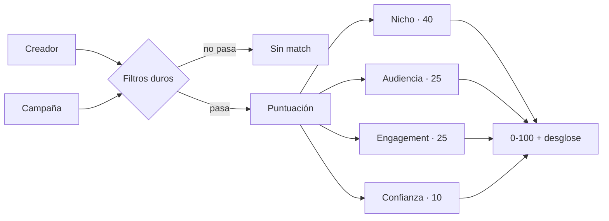

<div align="center">

# BrandFluence AI

**La plataforma que conecta creadores con marcas.**
Matching con IA para campañas UGC.

[](https://nextjs.org)
[](https://www.typescriptlang.org)
[](https://supabase.com)
[](#tests)
[](#estado-del-proyecto)

</div>

---

## El problema

El 95% de los creadores de contenido nunca encuentra marcas con las que colaborar. No porque no tengan audiencia, sino porque **no existe un sitio donde una marca busque "creadora de fitness con más de 20.000 seguidores y buen engagement" y obtenga una lista ordenada**.

Las marcas, por su lado, pagan agencias caras o van a ciegas por DM.

BrandFluence AI puntúa cada pareja creador–campaña del 0 al 100 y explica por qué.

---

## Estado del proyecto

> **MVP en desarrollo activo. Todavía no está desplegado ni tiene usuarios reales.**

Lo que ya funciona, recorrido entero en el navegador contra una base de datos y un Storage reales:

| | |
|---|---|
| ✅ | Registro, login y cierre de sesión (email + Google) |
| ✅ | Perfiles de creador y de marca, editables |
| ✅ | Publicación de campañas |
| ✅ | **Algoritmo de matching** con puntuación explicada |
| ✅ | Aplicar y descartar candidaturas |
| ✅ | **Rechazar a un candidato** (marca) |
| ✅ | Panel diferenciado para creador y para marca |
| ✅ | **Aceptar candidato → crear colaboración** |
| ✅ | **Entregables y cierre de la colaboración** |
| ✅ | **Métricas de rendimiento reportadas por el creador** |
| ✅ | **Subida de imágenes y vídeo** a Supabase Storage |
| ✅ | **Registro del pago**, declarado por las dos partes |
| ✅ | **Notificaciones in-app** con campana y contador |
| 📋 | Pasarela de pago (Wompi o Mercado Pago) |
| 📋 | Apps nativas iOS y Android (Expo) |

---

## Cómo funciona el matching

El corazón del producto. Una función **pura** —sin base de datos, sin efectos— que recibe un perfil y una campaña y devuelve una puntuación con su desglose.



### Filtros duros

No son penalizaciones: si no se cumplen, **el match no llega a existir**.

- El nicho del creador no es igual ni afín al de la campaña
- Su audiencia no llega al mínimo exigido
- Está marcado por sospecha de fraude

### Los cuatro componentes

| Componente | Puntos | Criterio |
|---|--:|---|
| **Nicho** | 40 | Coincidencia exacta 40 · nicho afín 24 |
| **Audiencia** | 25 | Cuánto supera el mínimo, con rendimientos decrecientes |
| **Engagement** | 25 | Puntuación completa a partir del 6% |
| **Confianza** | 10 | Verificado +5 · bio completa +3 · sin señales de fraude +2 |

### Tres decisiones que lo diferencian

**La audiencia satura a 10× el mínimo.** Pasar de 10× a 100× no convierte a nadie en un candidato diez veces mejor, y los micro-influencers suelen convertir mejor que los macro. Sin este tope, el algoritmo solo recomendaría cuentas enormes.

**Existen los nichos afines.** Una creadora de fitness ve campañas de salud puntuadas a 24 sobre 40, en lugar de no verlas nunca. El mapa de afinidades se declara en un sentido y se simetriza solo, así que no puede quedar desparejado.

**"Sin datos de engagement" no es "engagement 0".** Quien todavía no ha rellenado el campo recibe una puntuación baja pero no nula. Quien tiene un 0% real recibe cero. Confundirlos castigaría a los usuarios nuevos.

### Un ejemplo real

Lucía: nicho fitness, 48.200 seguidores, 5,4% de engagement, con bio, sin verificar.

| Campaña | Nicho | Audiencia | Engag. | Conf. | **Total** |
|---|--:|--:|--:|--:|--:|
| Lanzamiento proteína vegana *(fitness, mín. 10k)* | 40 | 21,83 | 22,5 | 5 | **89,33** |
| Reto 30 días en casa *(fitness, mín. 20k)* | 40 | 18,82 | 22,5 | 5 | **86,32** |
| Suplementos bienestar *(salud, mín. 5k)* | 24 | 24,84 | 22,5 | 5 | **76,34** |
| Colección ropa técnica *(moda, mín. 50k)* | — | — | — | — | **sin match** |

### Cuándo se recalcula

Al **publicar una campaña** y al **actualizar el perfil de un creador**.

Hay un invariante que el código protege en SQL, no con un `if`: recalcular **nunca** pisa un match que el creador ya aplicó o descartó.

```sql
ON CONFLICT (creator_id, campaign_id) DO UPDATE
   SET match_score = EXCLUDED.match_score
 WHERE matches.status = 'suggested'
```

---

## Del match a la colaboración

Un match recorre cinco estados, y cada transición la provoca una persona distinta:

```
sugerido ──creador aplica──> interesado ──marca acepta──> aceptado
    │                            │                           │
    │                            └──marca rechaza──> no seleccionado
    │                                                        │
    └──creador descarta──> descartado                        └──> colaboración
```

**`descartado` y `no seleccionado` son estados distintos** (`rejected` y `declined`), y la
diferencia no es cosmética:

- Los escribe gente distinta. Con un solo valor, el creador vería bajo «Descartadas»
  campañas que él nunca descartó.
- `rejected` es reversible a propósito: quien descarta puede cambiar de idea y aplicar
  después. Si la marca escribiera ahí, el creador rechazado podría re-postularse y
  reaparecer en la bandeja al instante. `declined` cierra la conversación.

Ninguno de los dos lo resucita el recálculo del matching, que solo toca filas `suggested`.

Aceptar hace dos cosas —mover el match a `accepted` y crear la colaboración— y **las dos ocurren en una sola sentencia SQL**. Si fueran dos, un fallo entre medias dejaría un match aceptado sin colaboración, y el `UNIQUE (match_id)` impediría repararlo reintentando. Una CTE que modifica datos lo resuelve sin reservar un cliente del pool ni escribir `BEGIN`/`COMMIT` a mano, algo que además el pooler de Supabase en modo *transaction* desaconseja:

```sql
WITH accepted AS (
  UPDATE matches m SET status = 'accepted'
    FROM campaigns c JOIN brands b ON b.id = c.brand_id
   WHERE m.id = $2 AND c.id = m.campaign_id
     AND b.user_id = $1              -- la autorización, dentro del WHERE
     AND m.status IN ('interested', 'accepted')
  RETURNING m.id AS match_id, c.budget
)
INSERT INTO collaborations (match_id, agreed_amount)
SELECT match_id, budget FROM accepted
ON CONFLICT (match_id) DO UPDATE SET updated_at = now()
```

Tres detalles que no son accidentales:

**El importe acordado sale del presupuesto de la campaña.** La marca ya lo publicó al crearla; volver a pedirlo al aceptar sería preguntar dos veces lo mismo. Negociarlo será una iteración posterior.

**Aceptar dos veces no falla.** Se admite `accepted` como estado de entrada y el `ON CONFLICT` devuelve la colaboración que ya existía. Un doble clic no se convierte en un 404 confuso.

**No se puede aceptar a quien no ha aplicado.** Un match en `suggested` no entra en el `IN (...)`: la marca no puede empujar a un creador a una colaboración que él no ha pedido.

Rechazar es la misma forma sin CTE —aquí no nace nada— y con una exclusión de más: `accepted` **no** está entre los estados de partida. Rechazar a alguien con la colaboración ya abierta dejaría una colaboración viva colgando de un match rechazado; para deshacer eso está cancelar la colaboración, que sabe qué hacer con los entregables y con el pago.

### La colaboración, una vez abierta

Nace `active` y muere en uno de dos estados terminales. Quién puede llevarla a cuál **no se decide con un `if`**: va en el `WHERE`, que es donde vive la relación real entre una persona y una colaboración.

| Acción | Marca | Creador |
|---|:--:|:--:|
| Definir los entregables | ✅ | — |
| Marcar un entregable como hecho | — | ✅ |
| Dar por **completada** | ✅ | — |
| **Cancelar** | ✅ | ✅ |

Completar es aceptar el trabajo recibido, y eso le toca a quien lo encargó. Cancelar lo pueden hacer los dos, porque cualquiera de las dos partes puede echarse atrás.

```sql
AND co.status = 'active'
AND (b.user_id = $1                              -- la marca, ambas cosas
     OR (cr.user_id = $1 AND $3::text = 'cancelled'))  -- el creador, solo cancelar
```

Ese `co.status = 'active'` es lo que hace terminales a los dos estados: una colaboración cancelada no se puede resucitar como completada.

### Los entregables viven en un JSONB, y eso obliga a tener cuidado

Son una lista dentro de una columna, no una tabla. Es lo correcto para un MVP —nunca se consultan por separado—, pero **dos personas distintas escriben en esa misma celda**: la marca edita los títulos, el creador marca lo entregado.

Si la marca leyera el JSONB, lo mezclara en TypeScript y lo escribiera de vuelta, un creador que marcase un entregable en ese hueco perdería su cambio. Por eso el merge ocurre **dentro del `UPDATE`**: al leer `co.deliverables` en la propia sentencia, Postgres bloquea la fila y, si otra transacción se le adelantó, reevalúa contra la versión nueva.

```sql
UPDATE collaborations co
   SET deliverables = (
     SELECT jsonb_agg(jsonb_build_object(
              'id',    incoming->>'id',
              'title', incoming->>'title',
              'done',  coalesce(previous.done, false),   -- ← se conserva
              ...
```

Y marcar un entregable reescribe solo ese elemento, no la lista entera, para que dos marcados seguidos no se pisen.

**Los ids los genera el servidor.** Si vinieran del cliente, una marca podría mandar el id de otra fila y arrastrar su estado de "entregado" a un entregable distinto. Un id que no estaba ya en esta colaboración simplemente no encuentra pareja en el `LEFT JOIN`, y el entregable nace pendiente.

### Y al final, cómo funcionó

El creador reporta visualizaciones, likes, comentarios, compartidos y guardados. Todo opcional: no todas las plataformas dan lo mismo, y obligar a rellenar un campo que no existe se resuelve inventándoselo.

**El engagement se calcula, no se guarda.** Un porcentaje almacenado junto a los números de los que sale es una contradicción esperando a ocurrir en cuanto alguien corrija una cifra.

Tres decisiones heredadas del resto del proyecto:

**"Sin visualizaciones" no es "0% de engagement".** Sin denominador no se puede dividir, y devolver un cero pondría al creador que aún no ha reportado en el mismo sitio que a uno cuyo vídeo no le interesó a nadie. Es exactamente la misma distinción que hace el algoritmo de matching con el campo vacío, y está cubierta por tests.

**Se puede reportar con la colaboración ya completada.** Los números de un vídeo siguen subiendo días después de publicarlo, y la marca suele cerrar antes de que se estabilicen. Atarlo a `active` condenaría a que las cifras finales no se registraran nunca. En una cancelada no hay nada que medir.

**Aquí no hace falta el merge en SQL de los entregables.** En esta columna escribe una sola persona, así que sustituir el objeto entero no puede pisarle nada a nadie. La complejidad de allí no era gratuita: era el precio de tener dos autores.

El validador rechaza un reporte con más likes que visualizaciones. No es una regla de negocio, es un cazador de erratas: el fallo típico es un cero de más al teclear.

Cinco cifras y un porcentaje **no son un gráfico**, son una fila de tiles. Un diagrama de barras con "likes" y "visualizaciones" en el mismo eje solo enseñaría que uno es mucho más grande que el otro, que ya se ve leyendo los números.

---

## El pago: por qué la plataforma no toca el dinero

BrandFluence **no cobra, no retiene y no transfiere**. El pago ocurre fuera y aquí solo queda el registro de lo que declara cada parte:

```
pendiente ──la marca: "he pagado"──> en curso ──el creador: "lo he recibido"──> pagada
```

Son tres decisiones encadenadas, y la primera es legal, no técnica.

**No manejamos plata ajena.** En Colombia, retener fondos de terceros puede caer en el terreno de la captación de recursos y en el ámbito de la Superintendencia Financiera. El día que entre una pasarela, el diseño correcto es que ella haga el reparto y disperse al creador; que el saldo nunca se quede esperando en una cuenta nuestra. Esto condiciona el código, así que está escrito aquí y no solo en la cabeza de alguien. *(No es asesoría legal: hay que validarlo con un abogado antes de mover dinero real.)*

**Nadie declara por el otro.** La marca no puede marcar la colaboración como cobrada, porque eso sería afirmar que el creador recibió un dinero que solo él puede confirmar. La regla vive en el `WHERE`, con el estado de origen exigido para que no se salte ningún paso:

```sql
AND (
  (b.user_id  = $1 AND $3 = 'processing' AND co.payment_status = 'pending')
  OR (b.user_id  = $1 AND $3 = 'pending'    AND co.payment_status = 'processing')
  OR (cr.user_id = $1 AND $3 = 'completed'  AND co.payment_status = 'processing')
)
```

**"En curso" no significa "pagada".** Significa que una de las dos partes lo dice. La pantalla lo enseña como dos casillas separadas, con quién afirmó cada una y cuándo, en vez de dar el pago por bueno cuando solo lo ha dicho quien paga.

Rectificar se puede, pero solo antes de que el otro confirme, y **borra todo el rastro**: fecha, método y referencia. Un método de pago sin pago sería un registro mintiendo.

### Los importes están en pesos, y eso no es solo una etiqueta

Todo se guarda y se muestra en **COP**. Cambiar la moneda arrastró tres cosas que no se ven en la pantalla:

**Las columnas se quedaban cortas.** Un peso vale unas 4.000 veces menos que un euro, así que las mismas cantidades pasan a tener cuatro dígitos más. `DECIMAL(10,2)` topa en 99.999.999 —unos 24.000 USD—, que el presupuesto mensual de una marca mediana desborda con facilidad. Y Postgres no trunca: da error `22003` y la operación falla. Ampliadas a `DECIMAL(14,2)` en la migración 002.

**El símbolo se pone a mano.** Pedirle a `Intl` el formato de moneda completo devuelve `$` + **U+00A0** + la cifra, y ese espacio duro depende de la versión de ICU: la de Node y la del navegador no tienen por qué coincidir. Como los importes se pintan en componentes cliente, una diferencia ahí rompe la hidratación. De `Intl` sale solo el agrupado de miles, que sí es estable.

**Había siete copias del formateador** repartidas por pantallas y componentes: siete sitios donde cambiar la moneda y siete oportunidades de que uno se quedara atrás. Ahora es uno, `src/lib/currency.ts`, con sus tests.

En casi toda la interfaz basta `$2.500.000`, porque el contexto ya es colombiano. En el panel de pago se escribe `$2.500.000 COP`: ahí el importe **es** el asunto, y confundirlo con dólares saldría caro.

### Detalles que salen de que esto es Colombia

Los métodos son `transferencia`, `nequi`, `daviplata`, `efectivo` y `otro`. Una lista pensada para Europa —"tarjeta, PayPal"— dejaría a casi todo el mundo eligiendo "otro": aquí Nequi y Daviplata mueven más dinero entre particulares que las tarjetas. Va como vocabulario cerrado con `CHECK` en la base, para poder agrupar por método el día que haya que conciliar sin normalizar cadenas a mano.

Y por eso **Stripe no era una opción**: Colombia no está entre sus países soportados, y el único camino sería constituir una sociedad fuera —con su contabilidad y sus impuestos en dos sitios— para acabar sin PSE ni Nequi, que es justo como paga la mayoría. Cuando toque cobrar de verdad, los candidatos son Wompi (Bancolombia) o Mercado Pago, que tienen reparto de pago y dispersión a cuentas colombianas. `paid_at` y `payment_reference` son los campos que habrá que casar entonces.

---

## Notificaciones: a quién hay que contárselo

Casi ninguna acción del producto le interesa a quien la hace. El creador ya
sabe que ha aplicado; quien necesita enterarse es la marca. Por eso las
notificaciones son **una tabla aparte de `events`**, y la diferencia cabe en
una línea:

| | `events` | `notifications` |
|---|---|---|
| `user_id` es… | quien **actúa** | quien **recibe** |
| Para qué | analítica | avisar a una persona |
| Si se pierde una | no lo nota nadie | alguien no se entera de que le aceptaron |

Esa última fila decide cómo se escriben. El `INSERT` de `events` va sin
`await` —es fuego y olvido—, pero el de las notificaciones se espera: en
serverless una promesa suelta puede morir cuando la función termina. Lo que
**no** hace es lanzar. Cuando se llega a ese punto la acción del usuario ya
está guardada, así que un 500 le diría que falló algo que funcionó, y le
invitaría a repetirlo.

### El texto se guarda, no se recompone al leer

Un aviso cuenta lo que pasó **cuando pasó**. Si la marca renombra la campaña
mañana, «Te aceptaron en «Proteína vegana»» sigue siendo lo que ocurrió;
recomponerlo al leer reescribiría el pasado. Y evita un JOIN polimórfico:
match, colaboración y entregable tienen formas distintas, y ese es justo el
sitio donde acaban apareciendo los `null`.

Todo el copy vive en `src/lib/notifications.ts`, un módulo puro y testeado,
para que cambiar cómo se lee un aviso no obligue a abrir seis rutas de API.

### Avisar dos veces es peor que no avisar

Aceptar y rechazar son idempotentes ante el doble clic —está hecho a
propósito, para que el segundo clic no devuelva un 404 confuso—. Eso, sin
más, manda **dos avisos idénticos**. Así que las dos consultas dicen ahora si
hubo cambio real:

- `acceptCandidate` devuelve `(xmax = 0) AS created`. En una fila recién
  insertada `xmax` vale 0; en la que sale por la rama `DO UPDATE`, no. Es la
  forma estándar de distinguir INSERT de UPDATE en un upsert sin una segunda
  consulta.
- `declineCandidate` lee el estado previo con una CTE, que ve la instantánea
  anterior al `UPDATE`.

Tampoco avisan las operaciones inversas: desmarcar un entregable, quitar un
adjunto, vaciar la lista o rectificar un pago declarado. Son rectificaciones,
y convertirlas en aviso llenaría la campana de ruido.

### El contador y el App Router

La campana la pinta el layout del panel, que cuenta las no leídas contra un
índice parcial. Y ahí hay un detalle que no se ve en los tipos ni en el SQL:
**un layout no se vuelve a renderizar al navegar por cliente**. Sin más, leer
los avisos los marcaba en la base pero la insignia seguía diciendo «3» el
resto de la sesión. Por eso la página dispara un `router.refresh()` —una vez,
y solo si de verdad marcó algo— que sí vuelve a pedir el árbol de servidor
entero.

Ese refresco trae su propia consecuencia: vuelve a pedir la lista, que ya
sale leída, y el resaltado de lo nuevo se borraba solo justo en la pantalla
que existe para verlo. La lista es un componente de cliente que **congela**
en `useState` lo que estaba sin leer al abrir, porque `router.refresh()`
conserva el estado del cliente.

Las dos cosas salieron en el navegador, no antes.

---

## Subida de ficheros

Fotos de perfil, logos y el contenido entregado. **Los bytes no pasan por esta app.**

```
navegador ──1. ¿puedo subir esto?──> /api/uploads ──> permiso firmado
    │
    └──2. el fichero, directo──────> Supabase Storage
    │
    └──3. guarda esta ruta─────────> /api/… ──> Postgres
```

Un endpoint serverless admite un cuerpo de unos pocos MB. Un vídeo de 50 MB no cabe por ahí ni troceándolo, y aunque cupiera sería pagar por mover bytes que Supabase ya sabe recibir, con una función ocupada durante toda la subida.

### Lo que decide el servidor

**La ruta del objeto, siempre.** El cliente pide permiso para "un `video/mp4` de 40 MB en esta colaboración"; nunca propone dónde va. Si la ruta viniera en la petición, cualquiera podría escribir en la carpeta de otra persona o salirse del bucket con un `../`.

**La extensión sale del tipo declarado, no del nombre.** Un `foto.jpg.svg` se guardaría como `.svg` y el navegador lo abriría como documento, con su script dentro.

**Allowlist, nunca denylist.** Una lista de lo prohibido siempre se queda corta: basta un formato nuevo para que se cuele algo que nadie previó.

### Dos buckets, no uno

| Bucket | Qué guarda | Visibilidad | Máximo |
|---|---|---|---|
| `media` | avatares y logos | pública | 5 MB |
| `deliverables` | el contenido entregado | **privada** | 50 MB |

Los avatares se enseñan en listados a gente que todavía no tiene ninguna relación con su dueño, y firmar cada miniatura sería una petición por avatar. El contenido entregado no: puede ser material de una campaña sin publicar y solo le importa a las dos partes de esa colaboración.

Por eso el fichero entregado se sirve desde `/api/collaborations/[id]/deliverables/[deliverableId]/media`, que **comprueba el permiso en cada petición** y redirige a una URL firmada que caduca en un minuto. Guardar la URL firmada en la base no serviría: envejecería con la fila.

### Reglas en un sitio, aplicadas en tres

Los tipos, los tamaños y los buckets se declaran una sola vez en `src/lib/uploads.ts` —módulo puro, sin SDK y sin `node:crypto`, para que el navegador pueda importarlo—. De ahí salen:

- el aviso del formulario, antes de empezar a subir algo que va a ser rechazado,
- la validación del servidor, que es la que cuenta,
- y los límites del propio bucket, que crea `scripts/check-storage.mjs` leyendo ese mismo fichero.

Así no puede pasar que el bucket acepte 50 MB y el formulario crea que son 200.

> Los 50 MB son el techo del plan gratuito de Supabase: un bucket no puede superar el límite global del proyecto. En un plan de pago se sube en *Settings > Storage* y luego en `uploads.ts`.

### Puesta en marcha

```bash
node scripts/check-storage.mjs --setup   # crea los buckets que falten
node scripts/check-storage.mjs           # comprueba: sube, lee y borra
```

La comprobación sube un PNG real de 1×1 —y no un `.txt`, que el bucket rechazaría por tipo antes de llegar a probar nada—, se lo descarga de vuelta por HTTP y lo borra. En el bucket privado comprueba además que **sin firmar no se lee**, que es la propiedad que de verdad importa: un bucket privado por error dejaría de serlo en silencio.

Necesita `NEXT_PUBLIC_SUPABASE_URL`, `NEXT_PUBLIC_SUPABASE_ANON_KEY` y `SUPABASE_SERVICE_ROLE_KEY`. Sin la service role key, `/api/uploads` responde **503**: falla cerrado, como el token de recálculo del matching.

---

## Stack

| Capa | Elección | Por qué |
|---|---|---|
| Framework | Next.js 16 (App Router) + React 19 | Un solo despliegue para front y back |
| Lenguaje | TypeScript | Los tipos se comparten con la futura app móvil |
| Estilos | Tailwind CSS v4 | Configuración en CSS, sin `tailwind.config.js` |
| Base de datos | PostgreSQL en Supabase | Postgres + Storage + SDKs nativos en un solo sitio |
| Autenticación | NextAuth v5 (Auth.js) | Estrategia JWT, pensando en las apps nativas |
| Validación | Zod | Mismos esquemas en API y formularios |
| Tests | Runner nativo de Node | Cero dependencias añadidas |

---

## Puesta en marcha

**Requisitos:** Node 22+ y una cuenta gratuita de [Supabase](https://supabase.com).

```bash
git clone https://github.com/dgh09/BrandFluence-AI.git
cd BrandFluence-AI
npm install
cp .env.example .env.local
```

**1. Crea el proyecto en Supabase** y copia la cadena de conexión del *Transaction pooler* (puerto **6543**, no el 5432 — en serverless el pooler es obligatorio) a `DATABASE_URL`.

**2. Carga el esquema.** En el SQL Editor de Supabase, pega entero `database/schema.sql` y ejecútalo. Crea 11 tablas.

> Si lo ejecutas dos veces verás `ERROR 42P07: relation already exists`. No es un fallo: significa que ya está aplicado. Para empezar de cero, ejecuta antes `database/reset.sql`.

**3. Genera el secreto de sesión:**

```bash
npx auth secret
```

**4. Arranca:**

```bash
npm run dev
```

Comprueba que la base de datos responde en `http://localhost:3000/api/health`.

### Datos de prueba

```bash
node scripts/seed-demo.mjs          # crea una creadora, una marca y 3 campañas
node scripts/seed-demo.mjs --clean  # los borra
```

El script imprime las credenciales de acceso al terminar.

---

## Scripts

| Comando | Qué hace |
|---|---|
| `npm run dev` | Servidor de desarrollo |
| `npm run build` | Compilación de producción |
| `npm test` | Auditoría de SQL + tests del algoritmo |
| `node scripts/db-inspect.mjs` | Qué tablas, triggers y datos hay ahora mismo |
| `node scripts/seed-demo.mjs` | Datos de demostración (`--clean` los borra) |
| `node scripts/check-sql-params.mjs` | Verifica los parámetros de cada consulta |
| `node scripts/check-storage.mjs --setup` | Crea los buckets de Storage |
| `node scripts/check-storage.mjs` | Sube, lee y borra un fichero de prueba |

> `seed-demo.mjs --clean` borra los usuarios de demo y todo lo que cuelga de
> ellos, pero **no** los ficheros que hubiera en Storage. Está en la hoja de ruta.

### Tests

```
✓ 44 consultas revisadas, todas cuadran
# tests 53
# pass 53
# fail 0
```

`check-sql-params.mjs` existe por un motivo concreto: escribir `$2` en una consulta pasando un solo parámetro es un error que **TypeScript no detecta** —no mira dentro de la cadena SQL— y que Postgres solo revela en tiempo de ejecución con un `42P18`. Se coló dos veces antes de automatizar la comprobación.

### Cuatro capas, porque cada una deja pasar lo de la siguiente

| Capa | Qué caza | Qué se le escapa |
|---|---|---|
| `tsc` | tipos | todo lo que vive dentro de una cadena SQL |
| `npm test` | la lógica pura: matching, engagement, reglas de subida | cualquier cosa que toque la base |
| Consultas contra Postgres, en una transacción con `ROLLBACK` | autorización, invariantes, transiciones de estado | que la UI llame bien a esas consultas |
| El recorrido en el navegador | que todo lo anterior esté conectado | — |

Las dos últimas no son opcionales. **Dos fallos reales no los cazó ninguna de las tres primeras**: la foto de perfil se subía bien y se veía en pantalla, pero el `UPDATE` no incluía la columna y se perdía al recargar; y un `<input type="number">` cambiaba de valor al pasar la rueda del ratón por encima, de forma que escribir 840 likes guardaba 842. Los dos parecían funcionar hasta que alguien usó la app.

Las comprobaciones contra la base van siempre dentro de `BEGIN … ROLLBACK` y **extraen el SQL del propio módulo** en vez de copiarlo, para no acabar verificando una copia que se quedó atrás.

---

## Estructura

```
src/
├─ app/
│  ├─ (auth)/          login · signup
│  ├─ (dashboard)/     panel · matches · campañas · candidatos ·
│  │                   colaboraciones · perfil
│  ├─ api/             toda la lógica de negocio
│  └─ onboarding/      elección de tipo de cuenta tras entrar con Google
├─ components/         ui/ · dashboard/ · profile/ · campaigns/ ·
│                      collaborations/ · shared/
└─ lib/
   ├─ matching.ts      ← el algoritmo (función pura)
   ├─ matching.test.ts ← sus 19 tests
   ├─ metrics.ts       ← engagement derivado (función pura)
   ├─ metrics.test.ts  ← sus 12 tests
   ├─ currency.ts      ← importes en pesos (pura)
   ├─ uploads.ts       ← reglas de subida (pura, vale en el navegador)
   ├─ uploads.test.ts  ← sus 16 tests
   ├─ storage.ts       ← Supabase Storage (solo servidor)
   ├─ queries/         acceso a datos por dominio
   ├─ taxonomy.ts      nichos y sectores
   ├─ design-tokens.ts tokens compartidos con la futura app móvil
   └─ auth.ts          configuración de NextAuth
database/
   schema.sql · reset.sql
   migrations/   cambios sobre un esquema ya aplicado
```

`schema.sql` es para instalaciones nuevas y **no** es idempotente. Sobre una base que ya existe van las de `migrations/`, que sí lo son (`IF NOT EXISTS`) y se pueden lanzar dos veces sin romper nada. Toda migración se refleja también en `schema.sql`, para que quien empiece de cero no herede una deuda.

**Toda la lógica de negocio vive en `/api/*`, nunca en Server Components.** No es casualidad: cuando lleguen las apps de iOS y Android consumirán exactamente los mismos endpoints, sin reescribir nada.

---

## Notas de seguridad

- **Los endpoints de "lo mío" no llevan id en la URL.** Es `/api/profile`, no `/api/creators/[id]`. La identidad sale de la sesión, así que no existe la posibilidad de editar el perfil de otra persona cambiando un identificador.
- **La autorización vive dentro del SQL.** Las acciones sobre un match filtran por `user_id` en el propio `WHERE`: un match ajeno afecta a cero filas. No hay una comprobación previa que se pueda olvidar.
- **Un recurso con dos dueños se resuelve igual.** Una colaboración es del creador *y* de la marca, y cada uno puede hacer cosas distintas. En vez de repartir esa regla entre la ruta y la consulta —dos sitios que un día dejan de coincidir—, está entera en el `WHERE`. Consultar una colaboración ajena devuelve cero filas y la página responde el mismo 404 que si no existiera: no se puede averiguar qué hay probando identificadores.
- **La unicidad se resuelve capturando la violación de constraint**, no con un `SELECT` previo, que dejaría una ventana de carrera entre la lectura y la escritura.
- Las contraseñas se guardan con bcrypt (coste 12). Los logins fallidos comparan contra un hash señuelo para que el tiempo de respuesta no revele si el email existe.

---

## Diseño

Interfaz *dark* y *mobile-first*: en el móvil es exactamente lo que ves, y en escritorio la barra inferior se convierte en barra lateral.

Hay **dos paletas separadas a propósito**. La de interfaz mantiene los colores de la referencia visual del proyecto. La de datos usa variantes ajustadas, porque los colores originales —un menta y un amarillo muy luminosos— quedan fuera de la banda de luminosidad OKLCH sobre fondo oscuro: perfectos para un botón, ilegibles para codificar información a quien tiene daltonismo.

Los tokens están duplicados en `src/lib/design-tokens.ts` porque React Native no entiende variables CSS, y ese fichero se reutilizará tal cual en la app de Expo.

---

## Hoja de ruta

- [x] Autenticación y perfiles
- [x] Campañas y candidaturas
- [x] Algoritmo de matching con puntuación explicada
- [x] Aceptar candidato y abrir la colaboración
- [x] Gestionar la colaboración: entregables y cierre
- [x] Métricas de rendimiento de la colaboración
- [x] Subida de imágenes y vídeo (Supabase Storage)
- [ ] Negociar el importe por candidato — hoy se hereda de la campaña
- [x] Que la marca pueda rechazar a un candidato
- [ ] Deshacer un rechazo — hoy `declined` es terminal y la tarjeta no vuelve a la bandeja
- [x] Registro del pago declarado por las dos partes
- [ ] Borrar de Storage los ficheros de una colaboración eliminada
- [x] Notificaciones in-app
- [ ] Avisar fuera de la app (email o push) — hoy hay que entrar para enterarse
- [ ] Cobro real con pasarela (Wompi o Mercado Pago) y comisión
- [ ] Briefs generados con IA
- [ ] Detección de seguidores falsos
- [ ] Apps nativas iOS y Android con Expo

---

<div align="center">

Construido en público por [@dgh09](https://github.com/dgh09)

*Todos los derechos reservados. Este repositorio es público para poder seguir el desarrollo,
pero todavía no tiene una licencia de código abierto asignada.*

</div>
